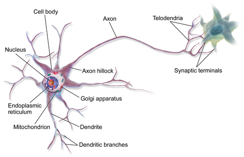
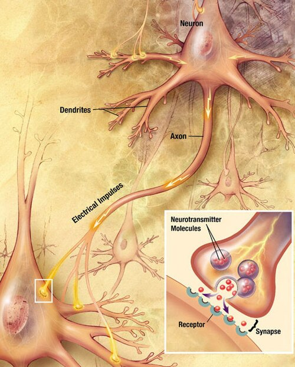
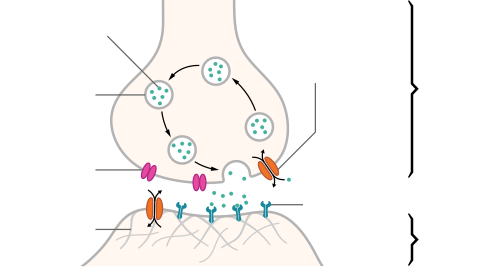
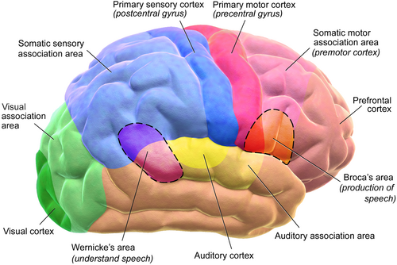
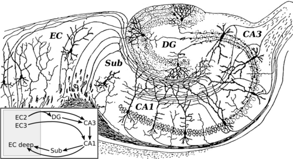
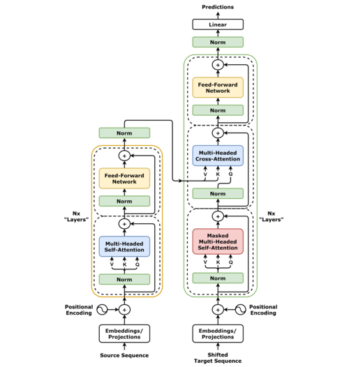

# Как работают естественные нейронные сети

> Мозг человека — самая сложная структура во Вселенной. 86 миллиардов нейронов, каждый из которых имеет до 10 000 синапсов. Это больше соединений, чем звёзд в Млечном Пути. И всё это помещается в 1.4 кг ткани, потребляя всего 20 Ватт — меньше, чем лампочка.

*Мультиполярный нейрон. Источник: Blausen Medical, Wikimedia Commons*

---

## 1. Нейрон и синапс

### Строение нейрона

Нейрон — электрическая клетка. В отличие от других клеток тела, он умеет генерировать и проводить электрические импульсы.

**Основные части:**

- **Дендриты** — «антенны», принимающие сигналы от других нейронов. У одного нейрона их могут быть тысячи
- **Тело клетки (сома)** — «процессор», где суммируются все входящие сигналы и принимается решение — firing или нет
- **Аксон** — «кабель», по которому сигнал передаётся другим клеткам. Длина аксона может достигать 1 метра (от спинного мозга до пальцев ног)
- **Миелиновая оболочка** — изоляция аксона, ускоряющая проведение сигнала в 100 раз. При рассеянном склерозе она разрушается

**Факт:** Скорость сигнала по миелинизированному аксону — до 120 м/с (432 км/ч). Без миелина — всего 0.5–2 м/с.

### Потенциал действия — как нейрон «стреляет»

Нейрон — это не выключатель «вкл/выкл», а пороговое устройство:

1. В покое внутри нейрона —70 мВ (мембранный потенциал)
2. Дендриты получают сигналы — одни возбуждающие (+), другие тормозные (−)
3. Если сумма сигналов в соме превышает порог (−55 мВ) — происходит «вспышка»
4. Потенциал действия бежит по аксону со скоростью до 120 м/с
5. После разряда — рефрактерный период 1–2 мс, нейрон «перезаряжается»

**Факт:** Нейрон коры может генерировать до 200 импульсов в секунду. Но в среднем он «стреляет» всего 0.1–10 раз в секунду — мозг работает экономно.

### Синапс — место встречи

Синапс — это место контакта двух нейронов. Не электрический разъём, а химический:

*Химический синапс. Источник: Wikimedia Commons*

1. Потенциал действия доходит до пресинаптической мембраны
2. Кальций входит в терминаль — это триггер выброса
3. Везикулы (пузырьки) сливаются с мембраной, высвобождая нейромедиатор
4. Молекулы диффундируют через синаптическую щель (20 нм) за 0.5 мс
5. Рецепторы на постсинаптической стороне связывают медиатор
6. Ионные каналы открываются → меняется мембранный потенциал

**Факт:** Один синапс может выделить от 1 до 5000 везикул за один раз. Везикула содержит около 5000 молекул нейромедиатора. Весь цикл — 1–5 миллисекунд.

**Факт:** Синаптическая щель — 20 нанометров. Для сравнения: толщина человеческого волоса — 80 000 нм. Щель в 4000 раз тоньше волоса.

---

## 2. Нейромедиаторы — язык мозга

Нейромедиаторы — это молекулы-«слова», которыми нейроны общаются друг с другом. Разные медиаторы = разные «смыслы».

*Структура химического синапса с нейромедиаторами. Источник: Wikimedia Commons*

### Возбуждающие (accelerator)

| Медиатор | Что делает | Интересный факт |
|----------|-----------|----------------|
| **Глутамат** | Основной возбуждающий медиатор мозга | Участвует в 80–90% синапсов коры. В избытке — нейротоксичен (глутаматная «возбуждотоксичность» убивает нейроны при инсульте) |
| **Ацетилхолин** | Работа мышц, внимание, память | Алзгеймер — гибель холинергических нейронов. Яд кураре блокирует ацетилхолиновые рецепторы → паралич |

### Тормозные (brake)

| Медиатор | Что делает | Интересный факт |
|----------|-----------|----------------|
| **ГАМК (GABA)** | Основной тормозной медиатор | Алкоголь, бензодиазепины (валидол, феназепам) усиливают ГАМК → торможение мозга → расслабление. Без ГАМК мозг впал бы в эпилептический статус |
| **Глицин** | Торможение в спинном мозге | Яд стрихнин блокирует глициновые рецепторы → судороги до смерти |

### Модуляторные (settings)

| Медиатор | Что делает | Интересный факт |
|----------|-----------|----------------|
| **Дофамин** | Мотивация, удовольствие, движение | Кокаин и амфетамины вызывают выброс дофамина. Болезнь Паркинсона — гибель дофаминергических нейронов в чёрной субстанции. Дофамин = не удовольствие, а *предвкушение* |
| **Серотонин** | Настроение, сон, аппетит | 95% серотонина — в кишечнике, не в мозге. Антидепрессанты (СИОЗС) повышают серотонин в синапсе. ЛСД структурно похож на серотонин |
| **Норадреналин** | Бодрствование, внимание, стресс | «Думерский» нейромедиатор. Выброс при опасности → фокус, учащённый пульс. Адреналин — «брат» норадреналина, но действует гормонально |
| **Эндорфины** | Обезболивание, эйфория | Морфий и героин — миметики эндорфинов. «Runner's high» — выброс эндорфинов при беге. Рецепторы эндорфинов обнаружены у всех позвоночных |

**Факт:** В мозге обнаружено более 100 различных нейромедиаторов и нейромодуляторов. Мы до сих пор не знаем функцию большинства из них.

**Факт:** Один нейрон может выделять несколько медиаторов одновременно — это называется cotransmission. Раньше считалось что один нейрон = один медиатор (закон Дейла). Оказалось — нет.

---

## 3. Зоны мозга — карта процессоров

Мозг — не единый «компьютер», а коллекция специализированных модулей, работающих параллельно.

*Функциональные зоны мозга. Источник: Blausen Medical, Wikimedia Commons*

### Кора больших полушарий (неокортекс)

Тонкий слой серого вещества толщиной 2–4 мм, площадь ~2500 см² (как 4 листа А4). Сильно изрезан складками (извилинами) чтобы вместиться в череп.

| Зона | Функция | Интересный факт |
|------|---------|----------------|
| **Лобная доля** | Планирование, решения, контроль импульсов, речь (зона Брока) | Финеас Гейдж — прораб, которому стальной стержень пробил лобную долю. Выжил, но стал грубым и импульсивным. Первый случай «лоботомии» |
| **Височная доля** | Слух, распознавание лиц, память, речь (зона Вернике) | Зона Вернике повреждена — можно говорить, но речь бессмысленна («словесная окрошка»). Зона Брока повреждена — понимаешь речь, но не можешь говорить |
| **Теменная доля** | Пространство, координация, математика, ощущение тела | При повреждении — синдром игнорирования: пациент не замечает половину пространства |
| **Затылочная доля** | Зрение, обработка изображений | 30% коры занято зрением — самый ресурсоёмкий процесс. Зрительная кора больше, чем все остальные сенсорные зоны вместе взятые |

### Подкорковые структуры — «древний мозг»

| Структура | Функция | Интересный факт |
|-----------|---------|----------------|
| **Гиппокамп** | Формирование новых воспоминаний, навигация | Пациент H.M. — после удаления гиппокампа потерял способность формировать новые воспоминания, но помнил всё до операции. Лондонские таксисты имеют увеличенный гиппокамп |
| **Миндалина** | Страх, эмоции, оценка угрозы | При синдроме Урбаха-Вите (кальцификация миндалины) люди перестают чувствовать страх. Совсем |
| **Базальные ганглии** | Движение, привычки, обучение навыкам | Болезнь Паркинсона — гибель нейронов в чёрной субстанции (часть базальных ганглий). Привычки формируются когда базальные ганглии «автоматизируют» повторяющиеся действия |
| **Таламус** | Ретранслятор сигналов, «коммутатор» | Все сенсорные сигналы (кроме обоняния) проходят через таламус прежде чем попасть в кору. Обоняние — самый древний и прямой путь |
| **Гипоталамус** | Голод, жажда, температура, сон, гормоны | Весит всего 4 грамма, но контролирует практически всю вегетатику. Повреждение → невозможность регуляции температуры тела |

### Мозжечок

Содержит **больше нейронов, чем весь остальной мозг вместе взятый** — 69 миллиардов из 86. При этом составляет лишь 10% объёма мозга.

Раньше думали что мозжечок только координирует движения. Сейчас выяснилось что он участвует в мышлении, языке, эмоциях.

**Факт:** Если развернуть кору мозжечка в плоский лист — получится полоска 1 метр длиной и 50 мм шириной. Кора больших полушарий — те же 2500 см², но она толще и сложнее организована.

### Принципы организации

- **Топографические карты** — соседние нейроны обрабатывают соседние участки поля зрения/кожи. Соматосенсорная кора — это «карта тела» (гомункулюс)
- **Иерархия** — от простых признаков (линия, край) к сложным (лицо, объект). В зрительной коре V1→V2→V4→IT
- **Параллельная обработка** — «что» (вентральный путь) и «где» (дорсальный путь) обрабатываются одновременно
- **Реципрокные связи** — каждый регион, посылающий сигнал «вверх», получает обратную связь «снизу». Обратных связей больше чем прямых

**Факт:** Мозг не имеет болевых рецепторов. Нейрохирургические операции часто проводятся при сознании пациента.

---

## 4. Память и пластичность — как мозг перестраивается

Память — это не «жёсткий диск» и не «флешка». Это непрерывное физическое изменение структуры мозга. Каждый раз когда вы что-то запоминаете — физически меняются синапсы.

*Рисунок нейронов гиппокампа Сантьяго Рамон-и-Кахаля (1905). Источник: Wikimedia Commons*

### Типы памяти

| Тип | Длительность | Ёмкость | Где хранится |
|-----|-------------|---------|-------------|
| Сенсорная | 0.1–2 сек | Огромная | Сенсорные зоны коры |
| Кратковременная | 15–30 сек | 7±2 элементов | Префронтальная кора |
| Рабочая | Минуты | 4–7 «чанков» | Префронтальная кора + теменная |
| Долговременная | Часы–вся жизнь | Теоретически безгранична | Гиппокамп → распределённо по коре |

**Факт:** «Магическое число 7±2» — Джордж Миллер обнаружил в 1956 что рабочая память держит 5–9 элементов. Китайцы в среднем держат 9 цифр (их цифры — односложные = меньше нагрузки).

### Как формируются воспоминания

1. **Кодирование** — сенсорный сигнал проходит через гиппокамп
2. **Консолидация** — гиппокамп «проигрывает» воспоминание заново во сне (REM-фаза), постепенно передавая его в кору
3. **Хранение** — воспоминание распределено по миллионам синапсов в разных зонах коры (лицо — в fusiform area, голос — в слуховой коре, эмоция — в миндалине)

**Факт:** Воспоминание извлекается не как «файл с диска», а как реконструкция. Каждый раз воспоминание пересобирается заново — поэтому свидетельские показания настолько ненадёжны. Память — не видео, а пьеса, которую каждый раз играют заново.

### LTP и LTD — клеточные механизмы обучения

**Долговременная потенциация (LTP):** если два нейрона «стреляют» одновременно, синапс между ними усиливается. Это клеточный аналог правила Хебба: «Neurons that fire together, wire together».

- АМРА-рецепторы вставляются в постсинаптическую мембрану
- NMDA-рецепторы работают как «совпадающий детектор» — открываются только если пресинаптический выброс И постсинаптическая деполяризация
- Структурные изменения — синапс физически растёт, появляются новые шипики на дендритах

**Долговременная депрессия (LTD):** слабая стимуляция → синапс ослабляется. Мозг не только учится, но и «забывает» — это необходимо чтобы не переполниться.

**Факт:** NMDA-рецептор — это молекулярный «AND gate». Он открывается только при совпадении двух условий: глутамат связан И мембрана деполяризована. Это идеальный детектор совпадения — основа ассоциативного обучения.

### Нейрогенез — новые нейроны

До 1990-х считалось что новые нейроны у взрослых не образуются. Потом обнаружили нейрогенез в гиппокампе — по 700 новых нейронов в день.

- Физические упражнения увеличивают нейрогенез в 2–3 раза
- Хронический стресс подавляет нейрогенез
- Антидепрессанты работают частично через стимуляцию нейрогенеза

**Факт:** Нейроны обонятельной луковицы обновляются каждые 30–60 дней. Это единственный регион где массово заменяются нейроны, работающие «на передовой» прямого контакта с внешней средой.

### Сон и память

Сон — не «выключение мозга», а активный процесс обработки данных:

- **Медленный сон (NREM):** перенос воспоминаний из гиппокампа в кору. «Сброс буфера»
- **REM-сон:** интеграция воспоминаний, эмоциональная обработка, «креативное комбинирование»
- Во сне таламус блокирует сенсорный вход — мозг работает с внутренними данными

**Факт:** После бессонной ночи способность к обучению падает на 40%. Гиппокамп буквально «переполнен» и не может кодировать новое.

---

## 5. Биологические vs искусственные нейронные сети

Биологические нейросети вдохновили создание искусственных. Но «вдохновили» — ключевое слово. Разрыв огромный.

*Структура искусственной нейросети. Источник: Wikimedia Commons*

### Сходства

| Свойство | Биологическая НС | Искусственная НС |
|----------|-----------------|-----------------|
| Базовый элемент | Нейрон | Нейрон (математическая абстракция) |
| Связи | Синапсы | Веса |
| Обучение | Изменение силы синапсов | Изменение весов |
| Нелинейность | Потенциал действия (порог) | Функция активации (ReLU, sigmoid) |
| Архитектура | Слои (корковые колонки) | Слои (layers) |

### Принципиальные различия

| Свойство | Биологический нейрон | Искусственный нейрон |
|----------|----------------------|----------------------|
| **Типы сигналов** | Импульсы (spikes) — дискретные во времени, непрерывная частота | Действительные числа — непрерывные значения |
| **Временное кодирование** | Время импульса несёт информацию (когда стреляет — важно) | Нет — только величина активации |
| **Типы нейронов** | Сотни типов (пирамидные, корзинчатые, звездчатые, клетки Пуркинье...) | Один тип — «универсальный нейрон» |
| **Торможение** | Отдельные тормозные нейроны (ГАМК-ергические) — ~20% всех нейронов | Отрицательные веса — нет разделения на возбуждающие/тормозные |
| **Обратные связи** | Массовые рекуррентные связи между слоями | В основном однонаправленные (feedforward), RNN — редкость |
| **Обучение** | Локальное (правило Хебба, STDP) — нейрон учится сам | Глобальное (backpropagation) — ошибка распространяется назад |
| **Потребление** | ~20 Ватт (весь мозг) | 100–1000+ Ватт (одна GPU) |
| **Дендритные вычисления** | Дендриты — не просто «провода», а полноценные процессоры | Входы — просто сумма произведений |

### Обучение: Хебб vs Backprop

**Правило Хебба (1949):** «Если нейрон A возбуждает нейрон B, и это происходит многократно, то сила связи A→B возрастает». Локальное правило — нейрону нужна информация только от своих соседей.

**STDP (Spike-Timing-Dependent Plasticity):** уточнение правила Хебба. Если A стреляет ДО B — связь усиливается. Если A стреляет ПОСЛЕ B — связь ослабляется. Это учитывает причинность.

**Backpropagation:** алгоритм обучения ИНС. Вычисляет градиент ошибки по каждому весу и корректирует его. Требует «знать» правильный ответ и передавать ошибку назад через все слои. Биологически нереалистично — нет доказательств что мозг использует backprop.

**Факт:** Hinton, «отец глубокого обучения», работал над «Forward-Forward Algorithm» — попыткой сделать обучение более биологически правдоподобным. Главная проблема backprop с биологической точки зрения: нужно хранить все промежуточные активации и передавать информацию «назад» по тем же связям.

### Почему ИНС работают если они так далеки от мозга?

Потому что для задач вроде классификации изображений не нужно копировать мозг целиком. Достаточно уловить принцип: слои признаков + обучаемые веса + нелинейность.

Но для задач требующих: обучение на одном примере (one-shot), энергонезависимость, continuous learning без катастрофического забывания — биологический подход всё ещё недостижим.

---

## 6. Мозг vs LLM — кто кого?

Большие языковые модели (LLM) — GPT-4, Claude, Gemini — это вершина развития искусственных нейросетей. Но насколько они похожи на мозг?

*Архитектура Transformer — основа современных LLM. Источник: Wikimedia Commons*

### Числа

| Параметр | Мозг человека | GPT-4 (оценка) |
|----------|--------------|----------------|
| «Параметры» (синапсы) | ~100 триллионов (10^14) | ~1.8 триллиона (10^12) |
| Нейроны | 86 миллиардов | 0 (нет нейронов, только веса) |
| Потребление | 20 Ватт | ~500 000 Ватт (обучение) |
| Обучающих данных | ~2 млрд «токенов» за жизнь (зрение+слух+осязание) | ~13 триллионов токенов текста |
| Время обучения | 20+ лет непрерывно | ~100 дней на кластере GPU |
| Архитектура | 100+ типов нейронов, рекуррентность, нейромодуляция | Transformer (self-attention), однородные слои |

### Что LLM делают лучше мозга

- **Хранение фактов** — LLM «выучила» практически весь публичный текст человечества. Ни один человек не прочтёт и миллионной доли
- **Скорость вывода** — генерация токенов за миллисекунды. Человеку нужно секунды чтобы сформулировать мысль
- **Многозадачность** — одна модель переводит, программирует, анализирует, пишет стихи

### Что мозг делает лучше LLM

- **One-shot learning** — увидел лицо однажды, запомнил навсегда. LLM нужно миллионы примеров
- **Энергоэффективность** — 20 Ватт vs мегаватты. Мозг в 25 миллионов раз экономичнее
- **Continuous learning** — мозг учится каждый день, не забывая старое. LLM забывает без дообучения (catastrophic forgetting)
- **Рассуждение в новых ситуациях** — мозг обобщает из 2–3 примеров. LLM нужны тысячи
- **Мультимодальность «из коробки»** — мозг seamlessly объединяет зрение, слух, осязание, запах, вкус, проприоцепцию. LLM вынуждены «склеивать» модальности отдельными моделями
- **Каузальное мышление** — мозг строит причинно-следственные модели мира. LLM — статистические «попугаи» (вспомним debate Bender et al. vs  OpenAI)

### 5 принципиальных отличий

1. **Статистика vs понимание.** LLM предсказывает следующий токен на основе статистических паттернов. Мозг строит внутреннюю модель мира (world model) и понимает причинно-следственные связи

2. **Одинаковые слои vs специализация.** Transformer — 96 одинаковых слоёв внимания. Мозг — 100+ зон с радикально разной архитектурой, нейромедиаторами и функциями

3. **Пассивный текст vs активное тело.** LLM обучается на тексте — пассивном отражении мира. Мозг обучается через взаимодействие с миром (embodied cognition). Ребёнок знает что такое «тяжёлый» потому что поднимал предметы, а не потому что прочитал определение

4. **Фиксированные веса vs живая пластичность.** После обучения LLM — статична. Веса не меняются. Мозг перестраивается каждую секунду. Каждый опыт физически меняет синапсы

5. **Генерация vs понимание.** LLM может блестяще объяснить квантовую физику, но не «понимает» её. Как калькулятор не понимает числа, хотя оперирует ими идеально. Мозг понимает — потому что связывает абстракции с сенсорным опытом

### Аналогия

LLM — это не «цифровой мозг». Это скорее **гигантская статистическая машина ассоциаций**, похожая на один специфический аспект мозга — языковую кору — но гипертрофированную и оторванную от всего остального.

Мозг — это не «биологический LLM». Это **автономный агент с внутренней моделью мира**, способный действовать, чувствовать, учиться и адаптироваться в реальном времени на 20 Ваттах.

---

## Заключение

Естественные нейронные сети — результат 600 миллионов лет эволюции. Каждый нейрон — сложнейшая клетка с десятками типов рецепторов, молекулярными машинами, способностью к пластичности. Каждая зона мозга — специализированный процессор с уникальной архитектурой.

Искусственные нейросети уловили главную идею — обучаемые веса + слои + нелинейность — и довели её до невероятных результатов. Но они используют упрощение настолько радикальное, что биологический нейрон больше похож на целую нейросеть, чем на один «нейрон» в PyTorch.

Разрыв сокращается: spiking neural networks, neuromorphic chips (Intel Loihi, IBM TrueNorth), нейроморфная камера Event Camera. Но до 20-ваттного мозга, обучающегося на ходу и понимающего мир — ещё очень далеко.

> «If the brain were so simple we could understand it, we would be so simple we couldn't.» — Lyall Watson

