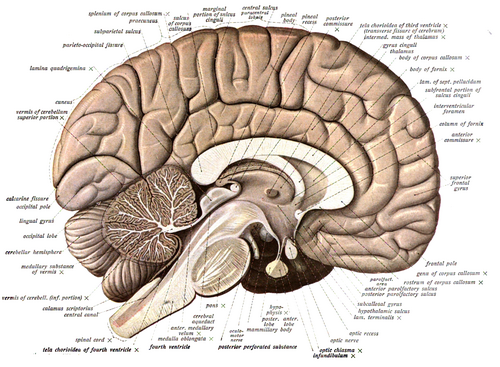
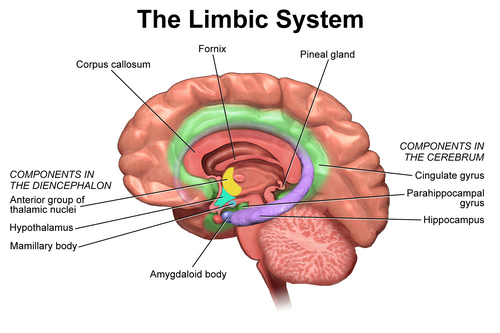
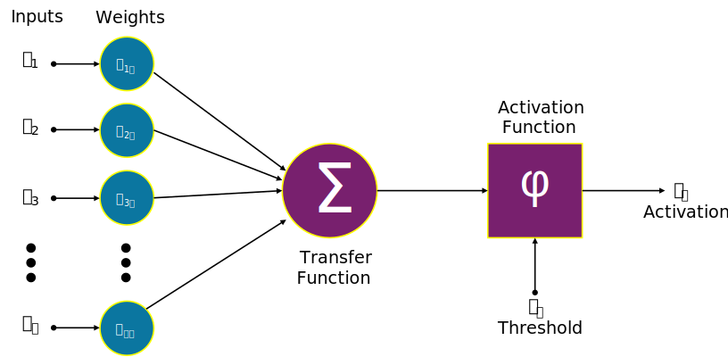

# Как работают естественные нейронные сети

> 86 миллиардов нейронов, 100 триллионов синапсов, 1.5 кг ткани, потребление 20 Вт. Мозг — самая сложная известная науке структура. Принципы его работы до конца не изучены.

*Мультиполярный нейрон. Источник: Blausen Medical, Wikimedia Commons*

---

## 1. Нейрон и синапс

### Строение нейрона

Нейрон — специализированная клетка, способная генерировать и проводить электрические импульсы. Его структура определяется функцией приёма, обработки и передачи сигнала.

**Дендриты** — разветвлённые отростки, принимающие входные сигналы от других нейронов. У одного нейрона может быть до 10 000 дендритных контактов. **Сома** (тело клетки) — место суммации всех входных сигналов и принятия решения о генерации импульса. **Аксон** — длинный отросток, по которому сигнал передаётся другим нейронам. Максимальная длина аксона достигает 1 метра — от спинного мозга до дистальных отделов конечностей.

**Миелиновая оболочка** — липидный слой, обёрнутый вокруг аксона. Обеспечивает сальтаторное (прыжкообразное) проведение импульса: сигнал перескакивает между перехватами Ранвье — участками аксона, свободными от миелина. Без миелина скорость проведения составляет 0.5–2 м/с. С миелином — до 120 м/с (432 км/ч). Разрушение миелина (рассеянный склероз) приводит к нарушению двигательных и сенсорных функций.

**Факт:** Скорость сигнала по миелинизированному аксону — до 120 м/с (432 км/ч). Без миелина — 0.5–2 м/с.

### Потенциал действия

Нейрон функционирует как пороговое устройство. В состоянии покоя мембранный потенциал составляет −70 мВ. Входные сигналы через дендриты делятся на возбуждающие (деполяризующие) и тормозные (гиперполяризующие) и суммируются в соме. Если суммарный потенциал достигает порога −55 мВ, происходит генерация потенциала действия.

Потенциал действия — кратковременное изменение мембранного потенциала, распространяющееся по аксону без затухания. Достигнув пресинаптической терминали, он вызывает выброс нейромедиатора в синаптическую щель. После разряда наступает рефрактерный период (1–2 мс), в течение которого нейрон не способен генерировать новый импульс — встроенный механизм защиты от перевозбуждения.

**Факт:** Нейрон коры может генерировать до 200 импульсов в секунду. Средняя частота спайкинга — 0.1–10 Гц. Мозг работает экономно: для нейрона молчание — норма, а не исключение.

### Синапс

Синапс — место контакта двух нейронов. Нейроны не соединяются напрямую: между ними находится синаптическая щель шириной 20 нанометров — в 4000 раз тоньше человеческого волоса.

*Химический синапс. Источник: Wikimedia Commons*

Передача через синапс происходит химически. Потенциал действия открывает кальциевые каналы пресинаптической мембраны. Ионы Ca²⁺ входят в терминаль, запуская экзоцитоз синаптических везикул. Везикулы сливаются с мембраной и высвобождают нейромедиатор в щель. Молекулы диффундируют к постсинаптической мембране, связываются с рецепторами и открывают ионные каналы, изменяя мембранный потенциал принимающего нейрона.

Один синапс может выделить от 1 до 5000 везикул за один акт передачи. В каждой везикуле — около 5000 молекул нейромедиатора. Полный цикл — от потенциала действия до изменения постсинаптического потенциала — занимает 1–5 мс.

**Факт:** Синаптическая щель — 20 нм. Толщина человеческого волоса — 80 000 нм. Щель в 4000 раз тоньше волоса.

---

## 2. Нейромедиаторы

Нейромедиаторы — химические вещества, передающие сигнал между нейронами. Электрическая передача (потенциал действия) обеспечивает скорость. Химическая передача (нейромедиаторы) обеспечивает специфичность: разные молекулы несут разные функциональные сигналы.

*Структура химического синапса с нейромедиаторами. Источник: Wikimedia Commons*

### Возбуждающие медиаторы

**Глутамат** — основной возбуждающий нейромедиатор. Участвует в 80–90% синапсов коры больших полушарий. Связывается с AMPA и NMDA-рецепторами, вызывая деполяризацию постсинаптической мембраны. В патологии: при инсульте избыточное выделение глутамата вызывает эксайтотоксичность — гибель нейронов от перевозбуждения.

**Ацетилхолин** — медиатор нейромышечных синапсов, вегетативной нервной системы и холинергических путей мозга. Отвечает за мышечное сокращение, внимание и формирование памяти. При болезни Альцгеймера холинергические нейроны дегенерируют первыми. Яд кураре блокирует никотиновые ацетилхолиновые рецепторы — наступает паралич скелетной мускулатуры и остановка дыхания.

| Медиатор | Функция | Факт |
|----------|---------|------|
| **Глутамат** | Основной возбуждающий медиатор | 80–90% синапсов коры. В избытке нейротоксичен (эксайтотоксичность при инсульте) |
| **Ацетилхолин** | Мышцы, внимание, память | Альцгеймер — гибель холинергических нейронов. Кураре блокирует рецепторы → паралич |

### Тормозные медиаторы

**ГАМК (GABA)** — основной тормозной нейромедиатор. Гиперполяризует постсинаптическую мембрану, подавляя возбуждение. Дефицит ГАМК приводит к эпилептической активности. Этанол, бензодиазепины (диазепам, феназепам) и барбитураты усиливают ГАМК-ергическую передачу — вызывают седацию, анксиолизис, миорелаксацию.

**Глицин** — тормозной медиатор спинного мозга и ствола головного мозга. Стрихнин блокирует глициновые рецепторы, вызывая одновременное сокращение всех мышц (опистотонус) и смерть от асфиксии.

| Медиатор | Функция | Факт |
|----------|---------|------|
| **ГАМК (GABA)** | Основной тормозной медиатор | Алкоголь и бензодиазепины усиливают ГАМК. Без ГАМК — эпилептический статус |
| **Глицин** | Торможение в спинном мозге | Стрихнин блокирует рецепторы → судороги, смерть от асфиксии |

### Модуляторные медиаторы

Модуляторные нейромедиаторы не вызывают прямого возбуждения или торможения. Они регулируют общий тонус нейронных сетей: настроение, мотивацию, уровень бодрствования, готовность к действию.

**Дофамин** — медиатор мотивации и системы вознаграждения. Сигнализирует об ожидании награды, а не о самом удовольствии (распространённое заблуждение). Дофаминергические нейроны расположены в чёрной субстанции и вентральной области покрышки. Кокаин и амфетамины вызывают массивный выброс дофамина, что лежит в основе зависимости. При болезни Паркинсона гибнут дофаминергические нейроны чёрной субстанции — развивается акинезия, ригидность, тремор.

**Серотонин** — регулятор настроения, сна, аппетита. 95% серотонина синтезируется в кишечнике энтерохромаффинными клетками. В ЦНС серотонин участвует в регуляции эмоционального фона. СИОЗС (селективные ингибиторы обратного захвата серотонина) — класс антидепрессантов. ЛСД структурно схож с серотонином и является агонистом серотониновых рецепторов 5-HT₂A.

**Норадреналин** — медиатор стресс-реакции и бодрствования. При выбросе норадреналина обостряется внимание, учащается сердцебиение, мобилизуются ресурсы организма.

**Эндорфины** — эндогенные опиоидные пептиды. Связываются с опиоидными рецепторами, обеспечивая анальгезию и эйфорию. Морфин и героин — экзогенные агонисты этих рецепторов. Опиоидные рецепторы обнаружены у всех позвоночных — от рыб до человека.

| Медиатор | Функция | Факт |
|----------|---------|------|
| **Дофамин** | Мотивация, движение | Кокаин, амфетамины → выброс дофамина. Паркинсон — гибель дофаминергических нейронов. Дофамин = предвкушение, а не удовольствие |
| **Серотонин** | Настроение, сон, аппетит | 95% — в кишечнике. СИОЗС — антидепрессанты. ЛСД структурно похож на серотонин |
| **Норадреналин** | Бодрствование, стресс | Выброс при опасности: фокус, тахикардия, мобилизация |
| **Эндорфины** | Обезболивание, эйфория | Морфин и героин — миметики. Рецепторы есть у всех позвоночных |

**Факт:** В мозге идентифицировано более 100 нейромедиаторов и нейромодуляторов. Функция большинства изучена недостаточно.

**Факт:** Один нейрон может выделять несколько медиаторов одновременно (котрансмиссия). Долгое время действовал «закон Дейла»: один нейрон — один медиатор. Он оказался неверен.

---

## 3. Зоны мозга

Мозг — не единый гомогенный вычислитель, а система специализированных модулей. Каждый регион имеет свою архитектуру, свой нейромедиаторный профиль и свою функцию. Интеграция сигналов между регионами обеспечивает целостную работу мозга.

*Функциональные зоны мозга. Источник: Blausen Medical, Wikimedia Commons*

### Кора больших полушарий (неокортекс)

Неокортекс — тонкий слой серого вещества толщиной 2–4 мм. Общая площадь при развёртке — около 2500 см². Чтобы разместиться в черепной коробке, кора свёрнута в извилины и борозды. Глубина борозд определяет площадь поверхности и, соответственно, количество нейронов на единицу объёма.

Кора делится на четыре основные доли.

**Лобная доля** — управление исполнительными функциями: планирование, принятие решений, контроль импульсов, рабочая память. Здесь расположена зона Брока — моторный центр речи, обеспечивающий артикуляцию. Повреждение лобной доли сохраняет базовые функции (речь, движение, питание), но нарушает высшие: способность сдерживать импульсы, планировать действия, оценивать социальную уместность.

В 1848 году Финеас Гейдж, прораб на строительстве железной дороги, получил проникающее ранение черепа. Взрыв вбил металлический стержень длиной 1 метр через его левую щёку и макушку. Гейдж выжил, сохранил интеллект, память и речь. Но характер изменился радикально: из ответственного и тактичного человека он стал импульсивным, грубым, неспособным придерживаться планов. Это первый задокументированный случай изменений личности при повреждении лобной доли.

**Височная доля** — обработка слуховой информации, распознавание лиц, память, понимание речи (зона Вернике). При повреждении зоны Верники (афазия Вернике) пациент говорит бегло и грамматически правильно, но речь лишена смысла — слова не складываются в осмысленное высказывание. При повреждении зоны Брока (афазия Брока) пациент понимает речь, но не может произнести слова — сохранено понимание, нарушена продукция.

**Теменная доля** — пространственное восприятие, координация, математические операции, схема тела. При повреждении (особенно правого полушария) возникает синдром гемиспатиального игнорирования: пациент перестаёт замечать левую половину пространства. Рисует только правую часть объектов, ест только с правой стороны тарелки, бреет только правую половину лица.

**Затылочная доля** — обработка зрительной информации. Зрительная кора составляет около 30% всей площади неокортекса — больше, чем все остальные сенсорные зоны вместе взятые. Зрение — наиболее ресурсоёмкий сенсорный процесс мозга.

| Доля | Функция | Факт |
|------|---------|------|
| **Лобная** | Планирование, решения, контроль импульсов, речь (зона Брока) | Финеас Гейдж — стержень пробил лобную долю. Выжил, характер изменился радикально |
| **Височная** | Слух, лица, память, речь (зона Вернике) | Афазия Вернике — беглая бессмысленная речь. Афазия Брока — понимание без продукции |
| **Теменная** | Пространство, координация, математика | Гемиспатиальное игнорирование — пациент не замечает левую половину мира |
| **Затылочная** | Зрение | 30% коры занято зрительной обработкой |

*Внутренние структуры мозга. Источник: Sobotta, Wikimedia Commons*

### Подкорковые структуры

Под корой расположены эволюционно древние структуры, существующие у всех позвоночных. Они обеспечивают функции, сформировавшиеся задолго до появления неокортекса.

**Гиппокамп** — структура, необходимая для формирования новых декларативных воспоминаний и пространственной навигации. В 1953 году нейрохирург Уильям Сковилл удалил гиппокамп пациенту H.M. (Генри Молайсон) для лечения эпилепсии. Приступы прекратились, но H.M. потерял способность формировать новые воспоминания. Он сохранял память о событиях до операции, но каждое новое событие стиралось через минуты. Он прожил так до конца жизни — каждый день в мире, который перестал обновляться.

Исследование лондонских таксистов (Maguire et al., 2000) показало, что у водителей, сдавших экзамен The Knowledge (выучивание 320 маршрутов и 25 000 улиц, занимает 3–4 года), задняя часть гиппокампа физически увеличена по сравнению с контрольной группой. Демонстрация нейропластичности у взрослых людей.

**Миндалина** — обработка эмоций, особенно страха. Оценивает угрозу за миллисекунды — быстрее, чем кора успевает осознать стимул. При синдроме Урбаха-Вите (редкое генетическое заболевание с кальцификацией миндалины) пациенты теряют способность испытывать страх полностью. Они сохраняют когнитивное понимание опасности, но не испытывают страха как эмоции.

**Базальные ганглии** — управление движением, формирование привычек и автоматических навыков. При обучении новому навыку (вождение, спорт) движения осознанны и контролируются корой. По мере автоматизации контроль переходит к базальным ганглиям. При болезни Паркинсона гибнут дофаминергические нейроны чёрной субстанции, проецирующиеся в базальные ганглии — развиваются акинезия, ригидность, тремор покоя.

**Таламус** — релейный центр. Все сенсорные сигналы (зрительные, слуховые, соматосенсорные, вкусовые) проходят через таламус перед попаданием в кору. Исключение — обоняние: обонятельные сигналы идут напрямую в обонятельную кору и лимбическую систему, минуя таламус. Это объясняет выраженную связь запахов с эмоциями и воспоминаниями.

**Гипоталамус** — масса около 4 граммов. Контролирует голод, жажду, температуру тела, циркадные ритмы и эндокринную систему через гипофиз.

| Структура | Функция | Факт |
|-----------|---------|------|
| **Гиппокамп** | Память, навигация | H.M. — после удаления гиппокампа не формировал новые воспоминания. Таксисты Лондона — увеличенный гиппокамп |
| **Миндалина** | Страх, эмоции | Синдром Урбаха-Вите — кальцификация → полная потеря страха |
| **Базальные ганглии** | Движение, привычки | Паркинсон — гибель нейронов чёрной субстанции. Автоматизация навыков |
| **Таламус** | Коммутация сигналов | Все сигналы, кроме обоняния, проходят через таламус |
| **Гипоталамус** | Вегетатика, гомеостаз | 4 грамма, контролирует голод, жажду, температуру, гормоны |

*Лимбическая система. Источник: Blausen Medical, Wikimedia Commons*

### Мозжечок

В мозжечке находится 69 миллиардов нейронов — около 80% всех нейронов мозга при объёме 10% от общей массы. Высокая плотность нейронов обеспечивается специализированной архитектурой — зернистым слоем с клетками-зёрнами.

Традиционно мозжечок рассматривался как координатор движений: поддержание позы, равновесия, тонкая моторика. При повреждении мозжечка развивается атаксия — неточность движений, дисметрия (гипер- или гипометрия), интенционный тремор. Современные исследования показывают участие мозжечка в когнитивных функциях — языке, рабочей памяти, эмоциональной регуляции.

**Факт:** Кора мозжечка при развёртке образует полосу шириной 5 см и длиной около 1 метра. Кора больших полушарий — около 2500 см², но она толще и сложнее организована.

### Принципы организации

Мозг построен по нескольким архитектурным принципам:

- **Топографические карты** — соседние нейроны обрабатывают соседние участки сенсорного поля. На соматосенсорной коре существует «гомункулюс» — карта тела, где зоны с высокой чувствительностью (губы, кисти) занимают непропорционально большие площади
- **Иерархическая обработка** — от простых признаков к сложным. В зрительной коре: линия → край → контур → фигура → лицо. Каждый следующий уровень интегрирует информацию предыдущих
- **Параллельные потоки** — обработка идёт одновременно по нескольким каналам. В зрительной системе: вентральный поток («что») и дорсальный поток («где»)
- **Обратные связи** — нисходящие проекции от высших зон к низшим многочисленнее восходящих. Мозг не просто обрабатывает входной сигнал, но и активно предсказывает его

**Факт:** Ткань мозга не имеет болевых рецепторов. Нейрохирургические операции могут проводиться при сознании пациента. Мозг чувствует прикосновение к своему веществу, но не испытывает боли.

---

## 4. Память и пластичность

Память — не хранилище данных, а непрерывное физическое изменение структуры нейронных связей. Каждый акт запоминания сопровождается изменением формы, размера и силы синапсов. Воспоминание — это не файл, а конфигурация нейронной сети.

*Рисунок нейронов гиппокампа Сантьяго Рамон-и-Кахаля (1905). Источник: Wikimedia Commons*

### Типы памяти

Память — не единая система, а набор независимых подсистем, работающих параллельно.

**Сенсорная память** — кратковременный отпечаток стимула. Иконическая (зрительная) — до 500 мс, эхоическая (слуховая) — до 3–4 секунд. Ёмкость велика, длительность минимальна.

**Кратковременная память** — удержание информации в активном состоянии 15–30 секунд. Ёмкость ограничена. **Рабочая память** — оперативный буфер с возможностью манипуляции: удержание нескольких элементов и одновременная обработка.

**Долговременная память** хранится не локализованно, а распределена по разным зонам коры. Воспоминание о событии включает визуальный компонент (височная кора), слуховой (слуховая кора), эмоциональный (миндалина), облонятельный (обонятельная кора). Извлечение воспоминания — процесс реконструкции, а не чтения.

| Тип | Длительность | Ёмкость | Локализация |
|-----|-------------|---------|-------------|
| Сенсорная | 0.1–2 сек | Большая | Сенсорные зоны коры |
| Кратковременная | 15–30 сек | 7±2 элемента | Префронтальная кора |
| Рабочая | Минуты | 4–7 чанков | Префронтальная кора + теменная доля |
| Долговременная | Часы – вся жизнь | Практически безгранична | Гиппокамп → распределённо по коре |

**Факт:** Правило «7±2» установлено Джорджем Миллером в 1956 году. Рабочая память удерживает 5–9 элементов. Носители китайского языка удерживают в среднем 9 цифр — китайские числительные односложны, что ускорает артикуляционный цикл.

### Формирование воспоминания

Три последовательных этапа.

**Кодирование.** Сенсорная информация проходит через гиппокамп, который фильтрует входной поток. Гиппокамп не хранит воспоминания — он кодирует и маршрутизирует их.

**Консолидация.** Происходит преимущественно во время медленноволнового сна. Гиппокамп воспроизводит паттерны активности, зафиксированные при бодрствовании, в ускоренном режиме (replay), передавая информацию в неокортекс для долговременного хранения.

**Хранение и извлечение.** Воспоминание распределяется по корковым зонам. При извлечении мозг реконструирует событие из разрозненных компонентов — каждый раз заново. Это делает свидетельские показания подверженными искажениям: каждое воспоминание изменяет само себя.

**Факт:** Извлечение воспоминания — процесс реконструкции, а не чтения фиксированной записи. При каждом вспоминании воспоминание модифицируется — феномен реконсолидации. Поэтому свидетельские показания ненадёжны даже при полной уверенности свидетеля.

### LTP и LTD — клеточные механизмы

В 1949 году Дональд Хебб сформулировал правило: «Neurons that fire together, wire together». Если нейрон A повторно возбуждает нейрон B, синаптическая связь между ними усиливается. Правило Хебба — основа всех современных теорий обучения.

**Долговременная потенциация (LTP).** При одновременной активности пресинаптического и постсинаптического нейронов на постсинаптической мембране вставляются новые AMPA-рецепторы — связь усиливается. NMDA-рецептор функционирует как молекулярный детектор совпадения: его канал открывается только при выполнении двух условий одновременно — связывание глутамата и деполяризация мембраны. Это логическая операция И (AND gate), реализованная на уровне белка.

LTP сопровождается структурными изменениями: на дендритах образуются новые шипики (dendritic spines), формируются новые синаптические контакты. Мозг физически меняет микроструктуру.

**Долговременная депрессия (LTD).** Обратный процесс: при слабой, низкочастотной стимуляции синапс ослабляется. AMPA-рецепторы удаляются с мембраны. Забывание — не сбой, а необходимая функция: без селективного ослабления неиспользуемых связей сеть переполнилась бы шумом.

**Факт:** NMDA-рецептор — молекулярная реализация логического элемента И (AND gate). Открывается только при совпадении двух условий: связывание глутамата и деполяризация мембраны. Это детектор совпадения — основа ассоциативного обучения.

### Нейрогенез

До 1990-х годов считалось, что нейроны ЦНС не再生. Нейрогенез у взрослых млекопитающих был обнаружен в двух зонах: зубчатой извилине гиппокампа и обонятельной луковице. В гиппокампе образуется около 700 новых нейронов в день. К 50 годам популяция нейронов зубчатой извилины полностью замещается. Физическая нагрузка увеличивает нейрогенез. Хронический стресс и депрессия подавляют его.

**Факт:** Нейроны обонятельной луковицы обновляются каждые 30–60 дней. Это единственная зона мозга, где массово заменяются нейроны, контактирующие с внешней средой.

### Сон и консолидация памяти

Во сне мозг остаётся активным, но выполняет другие функции, чем при бодрствовании.

**Медленноволновой сон (NREM).** Гиппокамп переносит воспоминания из временного хранилища в неокортекс — процесс системной консолидации. Это перенос данных из буфера в постоянную память.

**Быстрый сон (REM).** Интеграция воспоминаний: связывание нового с уже существующими знаниями, эмоциональная обработка. В REM-фазе таламус блокирует сенсорный вход, и мозг обрабатывает только внутренние сигналы. Сновидения — продукт этой обработки.

**Факт:** После одной бессонной ночи способность к обучению падает на 40%. Гиппокамп не может кодировать новую информацию, пока не завершён перенос предыдущей в неокортекс.

---

## 5. Биологические и искусственные нейронные сети

Искусственные нейронные сети (ИНС) вдохновлены биологическими, но используют радикально упрощённую модель. Различия между живым нейроном и его математическим аналогом значительнее, чем между птицей и самолётом.

*Структура искусственной нейросети. Источник: Wikimedia Commons*

### История ИНС

**1943. Уоррен МакКаллок и Уолтер Питтс** предложили первую математическую модель нейрона: бинарный пороговый элемент. Если сумма взвешенных входов превышает порог — выход 1, иначе 0. Доказали, что сеть из таких элементов универсально вычислима — способна реализовать любую логическую функцию. Это первая формальная связь между нейробиологией и теорией вычислений.

**1958. Фрэнк Розенблатт, Cornell Aeronautical Laboratory.** Перцептрон.

Перцептрон — простейшая модель обучаемого нейрона. Алгоритм: входы умножаются на веса, суммируются, пропускаются через пороговую функцию. Обучение состоит в корректировке весов: если выход ошибочен, веса изменяются в направлении, уменьшающем ошибку.

Розенблатт реализовал перцептрон аппаратно — Mark I Perceptron. Физическое устройство: 400 фотодетекторов (матрица 20×20), 512 настраиваемых потенциометров (веса), моторы и реле для корректировки сопротивлений. Машина обучалась распознаванию простых изображений, корректируя потенциометры при ошибках.

New York Times заявила, что компьютер скоро будет «ходить, говорить, видеть, размножаться и осознавать своё существование». Это не произошло.

Перцептрон способен решать линейно разделимые задачи (логическое И, ИЛИ). Не способен решить XOR — «исключающее ИЛИ». Это ограничение казалось техническим. Оно оказалось фундаментальным.

*Математическая модель искусственного нейрона. Источник: Wikimedia Commons*

**1969. Марвин Минский и Сеймур Пейперт** опубликовали монографию «Perceptrons». Доказали математически, что однослойный перцептрон не может вычислить XOR. Книга была технически корректна и практически остановила исследования в области нейросетей на 15 лет. Это назвали «зимой искусственного интеллекта». Финансирование сокращено, исследователи переключились на символьный подход.

**1986. Румельхарт, Хинтон, Уильямс** опубликовали алгоритм обратного распространения ошибки (backpropagation) для многослойных сетей. Ошибка вычисляется на выходном слое и распространяется назад через скрытые слои, корректируя веса. Многослойный перцептрон с backpropagation решает задачу XOR. Это возродило нейросетевые исследования.

**1989. Ян ЛеКун** разработал свёрточную нейросеть LeNet для распознавания почтовых индексов. Первое коммерческое применение ИНС — автоматическое чтение чеков в банках США.

**2012. Алекс Крижевский** — AlexNet, свёрточная сеть, обученная на GPU. На конкурсе ImageNet (классификация 1.2 млн изображений, 1000 классов) AlexNet показала ошибку top-5 15.3% против 26.2% у второго места. Отрыв в 11 процентных пунктов. Эта дата считается началом эры глубокого обучения.

**2017. Vaswani et al., «Attention Is All You Need».** Архитектура Transformer. Замена рекуррентности механизмом self-attention. Все современные LLM (GPT, Claude, Gemini, LLaMA) — потомки этой архитектуры.

**Факт:** Между перцептроном Розенблатта (1958) и GPT-4 (2023) прошло 65 лет. Между первым полётом человека (1903) и высадкой на Луну (1969) — 66 лет. Развитие ИНС потребовало сопоставимого времени.

### Самоуправляемые машины

Первая автономная самоуправляемая машина — Stanford Cart (1961). Четырёхколёсная тележка с камерой и компьютером с 32 КБ оперативной памяти. Робот делал снимок, анализировал изображение 10–15 минут, затем перемещался на 1 метр. Цикл повторялся.

| Год | Машина | Достижение |
|-----|--------|------------|
| **1961** | Stanford Cart | Первый автономный мобильный робот. 1 м за 10–15 мин вычислений. 32 КБ ОЗУ |
| **1977** | Tsukuba (Япония) | Первый автономный автомобиль: 30 км/ч, отслеживание белых дорожных меток |
| **1986** | Mercedes (Дикманнс) | Автобан, 55–60 км/ч без водителя, компьютерное зрение |
| **1995** | Navlab 5 (CMU) | Питтсбург — Сан-Диего, 4500 км, 98% пути автономно |
| **2005** | Stanley (Stanford) | DARPA Grand Challenge: 212 км по пустыне Мохаве за 6 ч 53 мин |
| **2014** | Tesla Autopilot | Массовое внедрение системы автопилота |
| **2017** | Waymo | Беспилотное такси без водителя, Финикс, уровень 4 автономности |

**Факт:** Stanford Cart (1961) работал на 32 КБ ОЗУ. Waymo (2017) использует терабайты данных и десятки нейросетей (детекция объектов, сегментация дороги, оценка глубины, планирование траектории). Между ними — 56 лет.

### Сходства биологических и искусственных нейросетей

Принцип, объединяющий живые и искусственные сети: обучение через изменение силы связей. Не ручное программирование правил, а автоматическая корректировка весов.

| Свойство | Биологическая НС | Искусственная НС |
|----------|-----------------|-----------------|
| Базовый элемент | Нейрон | Математический нейрон (взвешенная сумма + функция активации) |
| Связи | Синапсы | Веса (числа) |
| Обучение | Изменение силы синапсов | Изменение весов |
| Нелинейность | Потенциал действия (порог) | Функция активации (ReLU, sigmoid, tanh) |
| Структура | Слои (корковые колонки) | Слои (layers) |

### Принципиальные различия

| Свойство | Биологический нейрон | Искусственный нейрон |
|----------|----------------------|----------------------|
| **Тип сигнала** | Импульсы (spikes) — дискретные во времени, информация в частоте и тайминге | Действительные числа — непрерывные значения активации |
| **Временное кодирование** | Тайминг импульса несёт информацию | Не используется — только амплитуда |
| **Типы нейронов** | Сотни морфологических и функциональных типов | Один тип — «универсальный нейрон» |
| **Торможение** | Отдельные тормозные нейроны (ГАМК-ергические) — ~20% | Отрицательные веса, нет разделения на типы |
| **Обратные связи** | Массивные рекуррентные связи между всеми уровнями | Преимущественно feedforward, RNN — редки |
| **Обучение** | Локальное (правило Хебба, STDP) | Глобальное (backpropagation) |
| **Потребление** | ~20 Вт (весь мозг) | 100–1000+ Вт (одна GPU) |
| **Дендритные вычисления** | Дендриты — активные вычислительные элементы | Входы — простая взвешенная сумма |

### Правило Хебба и Backpropagation

Правило Хебба локально: нейрону нужна информация только от непосредственных соседей. Пресинаптическая активность совпала с постсинаптической — связь усилилась. Никакого внешнего контроля.

STDP (Spike-Timing-Dependent Plasticity) — уточнение правила Хебба с учётом причинности. Если пресинаптический нейрон активируется за несколько миллисекунд ДО постсинаптического — связь усиливается (LTP). Если ПОСЛЕ — ослабляется (LTD). Это позволяет нейронной сети выявлять причинно-следственные связи на синаптическом уровне.

Backpropagation — глобальный алгоритм. Требует: (1) знания правильного ответа, (2) вычисления ошибки на выходе, (3) распространения ошибки назад через все слои с использованием производных функций активации, (4) хранения всех промежуточных активаций. Биологическая нереалистичность backpropagation признаётся исследователями, включая Джоффри Хинтона — «отца глубокого обучения». Хинтон разрабатывал Forward-Forward Algorithm — попытку создать обучение, совместимое с биологическими ограничениями.

**Факт:** Джоффри Хинтон считал backprop биологически неправдоподобным. Главная проблема: для backprop необходимы симметричные каналы передачи ошибки и хранение всех промежуточных активаций — ни то, ни другое не обнаружено в мозге.

---

## 6. Мозг и LLM

Большие языковые модели (GPT-4, Claude, Gemini) — вершина развития искусственных нейросетей. Степень их сходства с мозгом человека — предмет научной дискуссии.

*Архитектура Transformer — основа современных LLM. Источник: Wikimedia Commons*

### Количественное сравнение

| Параметр | Мозг человека | GPT-4 (оценка) |
|----------|--------------|----------------|
| Параметры (синапсы) | ~100 трлн (10¹⁴) | ~1.8 трлн (10¹²) |
| Нейроны | 86 млрд | 0 (только веса) |
| Энергопотребление | 20 Вт | ~500 000 Вт (обучение) |
| Объём обучающих данных | ~2 млрд «токенов» за жизнь | ~13 трлн токенов |
| Время обучения | 20+ лет непрерывно | ~100 дней на кластере GPU |
| Архитектура | 100+ типов нейронов, рекуррентность, нейромодуляция | Transformer (self-attention), однородные слои |

### Преимущества LLM

- **Объём хранимых знаний** — LLM обучена на значительной части всего публичного текстового корпуса человечества. Ни один человек не прочтёт и доли процента этого объёма
- **Скорость генерации** — десятки токенов в секунду. Человеку требуются секунды на формулирование высказывания
- **Универсальность** — одна модель переводит, программирует, анализирует данные, пишет тексты. Для каждого из этих навыков человеку требуются годы обучения

### Преимущества мозга

- **Обучение на одном примере** (one-shot learning) — человек запоминает лицо после одной встречи. LLM требуются миллионы примеров для сопоставимой задачи
- **Энергоэффективность** — 20 Вт против сотен киловатт при обучении LLM. Энергетический разрыв составляет ~5–6 порядков
- **Непрерывное обучение** — мозг обучается на протяжении всей жизни без катастрофического забывания. LLM после завершения обучения статична; дообучение на новых данных приводит к забыванию предыдущих
- **Обобщение из малого числа примеров** — мозг формирует абстрактные концепции из 2–3 примеров. LLM требуют тысяч
- **Мультимодальность** — мозг бесшовно интегрирует зрение, слух, осязание, обоняние, проприоцепцию. LLM требуют отдельных моделей для каждой модальности
- **Причинно-следственное моделирование** — мозг строит каузальные модели мира. LLM выявляют статистические корреляции

### Пять принципиальных отличий

**1. Статистическая аппроксимация vs каузальная модель.** LLM предсказывает следующий токен на основе статистических паттернов в обучающем корпусе. Мозг строит внутреннюю каузальную модель реальности и использует её для прогнозирования и планирования. LLM «знает», что после слова «небо» часто следует «голубое», но не имеет представления о том, что такое небо.

**2. Однородные слои vs специализация.** Transformer GPT-4 — 96 однотипных слоёв self-attention. Мозг — более 100 зон с различной архитектурой, нейромедиаторным профилем и морфологией нейронов. Однородность Transformer — его сила (масштабируемость) и его ограничение (отсутствие специализации).

**3. Текст vs embodied experience.** LLM обучается на тексте — описании мира, созданном другими. Мозг обучается через прямое сенсомоторное взаимодействие с миром. Ребёнок знает значение слова «тяжёлый», потому что поднимал тяжёлые предметы. LLM встречала это слово миллиарды раз, но не имеет сенсорного опыта.

**4. Статичные веса vs пластичность.** После обучения веса LLM зафиксированы. Мозг перестраивает синаптические связи непрерывно — каждый опыт физически меняет структуру. LLM не обучается в процессе взаимодействия с пользователем.

**5. Генерация vs понимание.** LLM может точно воспроизвести факты из квантовой физики, не обладая их пониманием — аналогично калькулятору, оперирующему числами без их осмысления. Мозг «понимает», потому что связывает абстракции с сенсомоторным опытом и телесностью.

### Соотношение

LLM — статистическая машина аппроксимации последовательностей, моделирующая один аспект работы мозга — языковую способность, но гипертрофированную и изолированную от остальных функций. Мозг — автономная система с внутренней моделью мира, способностью к действию, обучению и адаптации в реальном времени при энергопотреблении 20 Вт.

---

## Заключение

Естественные нейронные сети — результат 600 миллионов лет эволюции. От диффузной нервной сети кишечнополостных до мозга человека — путь длиной в миллиард лет. Каждый нейрон — клетка с десятками типов рецепторов, молекулярными машинами и механизмами пластичности. Каждая зона мозга — специализированный процессор с уникальной архитектурой.

Искусственные нейросети уловили основную идею — обучаемые веса, слои, нелинейность — и достигли на её основе значительных результатов. Но биологический нейрон по сложности ближе к целой нейросети, чем к одному искусственному нейрону в PyTorch.

Разрыв сокращается: spiking neural networks, нейроморфные процессоры (Intel Loihi, IBM TrueNorth), событийные камеры (event cameras). Но создание системы с эффективностью 20-ваттного мозга, обучающейся в реальном времени и строящей каузальную модель мира, — задача, которая далека от решения.

> Если бы мозг был достаточно прост, чтобы мы могли его понять, мы были бы слишком просты, чтобы его понять. — Лайалл Уотсон
