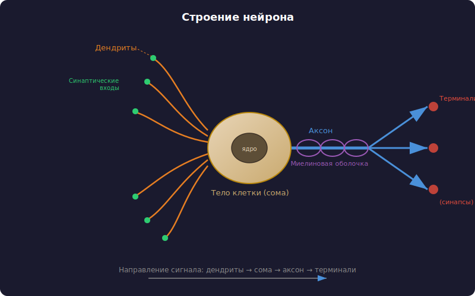
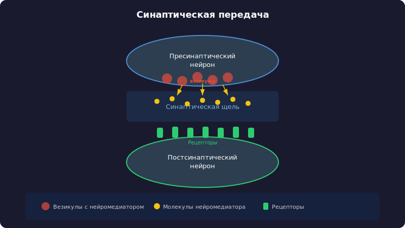
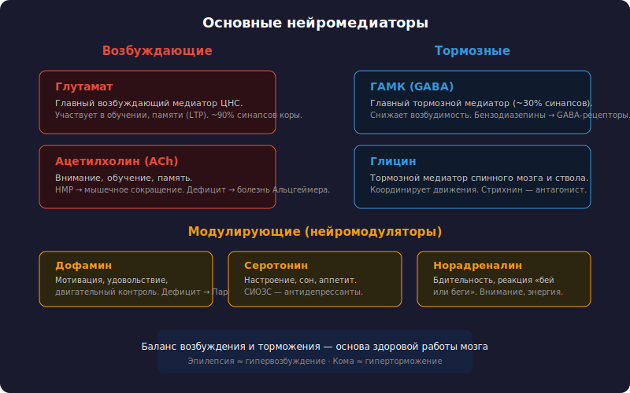
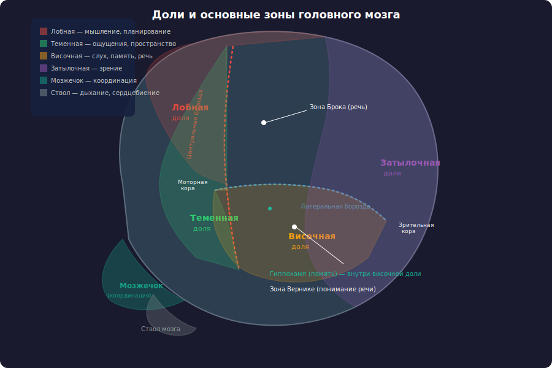
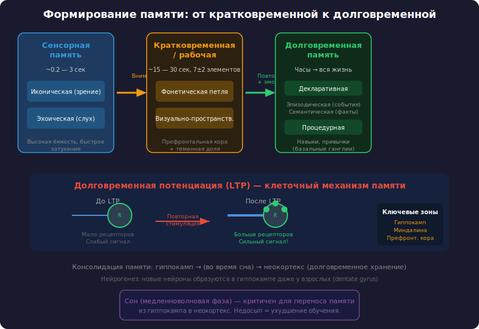
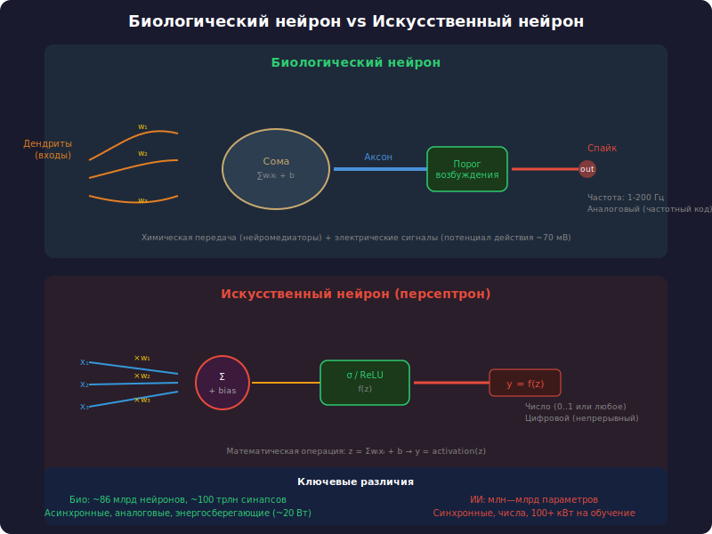
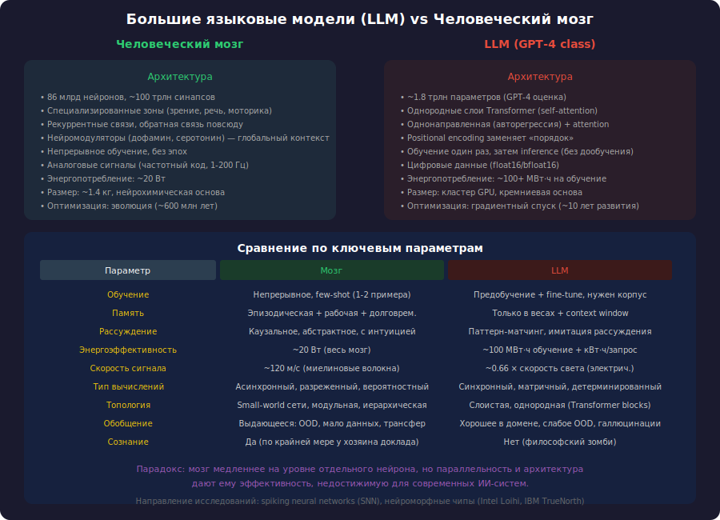

# Как работают естественные нейронные сети

## 1. Нейрон и синапс

### Строение нейрона

Нейрон — фундаментальная единица нервной системы. В мозге человека их около 86 миллиардов. Каждый нейрон состоит из трёх основных частей:

- **Тело клетки (сома)** — содержит ядро и органеллы. Здесь происходит суммация входящих сигналов и принимается решение о генерации импульса.
- **Дендриты** — ветвящиеся отростки, принимающие сигналы от других нейронов. У одного нейрона может быть до 10 000 дендритных входов.
- **Аксон** — длинный отросток (до 1 метра), передающий сигнал другим клеткам. заканчивается терминалями — кнопочными утолщениями, образующими синапсы.

Нейрон работает как пороговое устройство. Когда суммарный входной сигнал превышает определённый порог, по мембране аксона пробегает **потенциал действия** (спайк) — короткий электрический импульс амплитудой около 100 мВ и длительностью 1–2 мс. Скорость проведения — от 1 до 120 м/с в зависимости от наличия миелиновой оболочки.

### Синапс — место встречи

Синапс — это контакт между двумя нейронами, где происходит передача сигнала. Различают:

- **Химические синапсы** — большинство в мозге. Сигнал передаётся через нейромедиаторы.
- **Электрические синапсы** (щелевые контакты) — прямое электрическое соединение через коннексины. Быстрее, но менее гибкие.

Процесс химической синаптической передачи:

1. Потенциал действия достигает пресинаптической терминали.
2. Кальциевые каналы открываются, Ca²⁺ входит в клетку.
3. Везикулы с нейромедиатором сливаются с мембраной (экзоцитоз).
4. Молекулы медиатора диффундируют через синаптическую щель (20–40 нм).
5. Медиатор связывается с рецепторами на постсинаптической мембране.
6. Ионные каналы открываются, меняя мембранный потенциал постсинаптического нейрона.
7. Медиатор разрушается ферментами или захватывается обратно (реаптейк).

Весь цикл занимает 0,5–1 мс — это фундаментальное ограничение скорости обработки информации в мозге.

## 2. Нейромедиаторы

Нейромедиаторы — химические вещества, передающие сигнал между нейронами. Их действие определяется не столько самим веществом, сколько типом рецептора, к которому оно присоединяется. Один и тот же медиатор может быть возбуждающим в одном синапсе и тормозящим в другом.

### Возбуждающие

| Медиатор | Роль | Особенности |
|----------|------|-------------|
| **Глутамат** | Основной возбуждающий медиатор ЦНС | Участвует в 80–90% синапсов коры. Ключевой для обучения и памяти через NMDA-рецепторы |
| **Ацетилхолин** | Нервно-мышечная передача, внимание, память | Дефицит — одна из причин болезни Альцгеймера |

### Тормозные

| Медиатор | Роль | Особенности |
|----------|------|-------------|
| **ГААМ (GABA)** | Основной тормозной медиатор | Примерно в 20–30% синапсов коры. Снижает активность нейронов. мишень бензодиазепинов |
| **Глицин** | Тормозный медиатор спинного мозга и ствола | Модулирует моторные рефлексы |

### Модуляторные

| Медиатор | Роль | Особенности |
|----------|------|-------------|
| **Дофамин** | Мотивация, вознаграждение, двигательный контроль | Дефицит в чёрной субстанции → болезнь Паркинсона. Избыток в мезолимбическом пути → психозы |
| **Серотонин** | Настроение, сон, аппетит | Мишень антидепрессантов (СИОЗС). 95% серотонина — в кишечнике |
| **Норадреналин** | Бодрствование, концентрация, реакция на стресс | Выделяется голубым пятном (locus coeruleus). Усиливает внимание |
| **Эндорфины** | Обезболивание, чувство удовольствия | Эндогенные опиоиды. Связываются с теми же рецепторами, что и морфин |

Важный принцип: мозг не работает по принципу «один медиатор — одна функция». Это **динамическая система**, где баланс возбуждения и торможения (E/I balance) критически важен. Нарушение этого баланса лежит в основе эпилепсии (избыток возбуждения) и кататонии (избыток торможения).

## 3. Зоны мозга

### Кора больших полушарий (неокортекс)

Самая молодая в эволюционном плане структура, 2–4 мм толщиной, площадь около 2500 см². Состоит из шести слоёв (ламинарная организация). Различают функциональные зоны:

**Лобные доли (30% коры)**
- Префронтальная кора — планирование, принятие решений, рабочая память, социальное поведение. Развита у человека сильнее, чем у любых других видов.
- Моторная кора — произвольные движения. Карта тела (моторный гомункул) — каждому участку соответствует своя зона.

**Височные доли**
- Слуховая кора — обработка звука.
- Зона Вернике (левое полушарие) — понимание речи.
- Гиппокамп — формирование новых воспоминаний (консолидация памяти).
- Миндалина — эмоции, особенно страх и агрессия.

**Теменные доли**
- Соматосенсорная кора — осязание, проприоцепция, температура, боль.
- Пространственное внимание и интеграция сенсорных потоков.

**Затылочные доли**
- Зрительная кора (V1–V5) — обработка визуальной информации. Занимает наибольшую долю коры относительно размеров органа.

### Подкорковые структуры

| Структура | Функция |
|-----------|---------|
| **Таламус** | Ретранслятор сенсорной информации в кору. «Воротами сознания» |
| **Базальные ганглии** | Выбор действий, формирование привычек. Дофаминергическая система подкрепления |
| **Мозжечок** | Координация движений, моторное обучение. Содержит более 50% нейронов мозга при 10% массы |
| **Гипоталамус** | Гомеостаз: температура, голод, жажда, циркадные ритмы. Управляет гипофизом |

### Принцип работы

Мозг не работает как последовательный процессор. Это **массивно-параллельная система**: информация обрабатывается одновременно в множестве зон, образуя функциональные сети. Например, при чтении слова активируются зрительная кора, зона Вернике, угловая извилина и префронтальная кора — всё за сотни миллисекунд.

## 4. Память и перестройка нейронных связей

### Типы памяти

| Тип | Длительность | Ёмкость | Механизм |
|-----|-------------|---------|----------|
| Сенсорная | < 1 с | Большая | Ионные токи в рецепторах |
| Кратковременная | 15–30 с | 7±2 элемента | Реверберация нейронных цепей |
| Рабочая | Минуты | Ограничена | Активность префронтальной коры |
| Долговременная | Годами | Практически безгранична | Структурные изменения синапсов |

### Синаптическая пластичность

Основной механизм обучения в мозге — **изменение силы синаптических связей**. Не количество нейронов определяет память, а паттерн и сила их связей.

**Долговременная потенциация (LTP)**
- Открыта Блиссом и Ломо в 1973 году.
- При высокой частоте стимуляции синапса сила передачи возрастает и сохраняется часами и днями.
- Механизм: глутамат → NMDA-рецепторы → вход Ca²⁺ → активация CaMKII → вставка новых AMPA-рецепторов в мембрану.
- Правило Хебба: «Нейроны, которые активируются вместе, связываются вместе» (fire together, wire together).

**Долговременная депрессия (LTD)**
- Обратный процесс: слабая или низкочастотная стимуляция уменьшает силу синапса.
- Необходима для забывания нерелевантной информации и предотвращения «переобучения».
- Механизм: умеренный вход Ca²⁺ → активация фосфатаз → удаление AMPA-рецепторов.

### Структурная пластичность

Мозг способен к физической перестройке:

- **Спайайн-генезис** — образование новых дендритных шипиков (spines) при обучении. За час может образоваться до 100 новых шипиков на одном нейроне.
- **Синаптогенез** — формирование новых синапсов. У взрослого человека в гиппокампе образуются новые нейроны (нейрогенез), хотя масштабно это происходит лишь в двух зонах.
- **Прюning** (обрезка) — устранение неиспользуемых связей. У ребёнка к 2 годам количество синапсов достигает максимума, затем к подростковому возрасту сокращается примерно на 50%.

### Консолидация памяти

Процесс перевода воспоминания из кратковременной в долговременную:

1. **Кодирование** — hippocampus связывает разрозненные элементы опыта.
2. **Консолидация** — во время сна (особенно медленноволнового) воспоминание «проигрывается» заново, и связи переносятся в неокортекс.
3. **Реконсолидация** — при каждом воспоминании след памяти становится лабильным и может быть модифицирован. Память — не запись, а реконструкция.

Важно: воспоминание не хранится в одном нейроне. Оно распределено по сети из тысяч нейронов в разных зонах мозга. Удаление одного нейрона не стирает конкретное воспоминание — это принцип распределённого кодирования.

## 5. Сравнение с искусственными нейронными сетями

### Архитектурное сравнение

| Свойство | Биологический нейрон | Искусственный нейрон |
|----------|---------------------|---------------------|
| Типы сигналов | Импульсные (spikes) | Аналоговые (действительные числа) |
| Активация | Пороговая + рефрактерный период | Функция (ReLU, sigmoid, tanh) |
| Связи | Динамические, растут и отмирают | Фиксированные архитектурой |
| Обучение | Непрерывное, локальное (Хебб) | Обратное распространение (backprop) |
| Веса | Сила синапса + тип медиатора | Число с плавающей точкой |
| Входы | 1 000–10 000 синапсов | Зависит от слоя (обычно меньше) |
| Энергопотребление | ~20 Вт на весь мозг | Сотни кВт на обучение большой модели |
| Скорость | ~200 Гц макс. | ГГц на GPU |

### Фундаментальные различия

**1. Обратное распространение vs локальное обучение**

Искусственные сети обучаются через backpropagation — глобальный алгоритм, требующий знания ошибки на выходе и передачи градиента назад через все слои. В мозге такого механизма нет (биологически нереализуемо). Нейроны обучаются локально: каждый синапс меняется на основе активности только двух связанных нейронов (правило Хебба).

**2. Рекуррентность**

Мозг — рекуррентная сеть по природе: практически все связи двусторонние. Информация циркулирует, возвращается, смешивается. Искусственные сети (особенно трансформеры) преимущественноFeedForward с отдельными рекуррентными механизмами.

**3. Нейромодуляция**

В мозге действуют глобальные сигналы — дофамин, серотонин, норадреналин — меняющие режимы обучения целых областей. В ИНС аналогов мало (обычно — фиксированный learning rate).

**4. Структурная пластичность**

Мозг физически растёт и сокращается. ИНС имеют фиксированную архитектуру (кроме архитектур с нейросетевым поиском — NAS).

### Что ИНС уже умеют лучше

- Обработка больших массивов данных за короткое время.
- Запоминание точных последовательностей (биологическая память шумна и подвержена искажениям).
- Параллельное обучение на тысячах GPU.

## 6. Сравнение с большими языковыми моделями (LLM)

### Масштаб

| Параметр | Мозг человека | GPT-4 (оценка) | Llama 3 (405B) |
|----------|--------------|----------------|-----------------|
| «Параметры» | ~86 млрд нейронов, ~100 триллионов синапсов | ~1,8 триллиона | 405 миллиардов |
| Энергия | 20 Вт | ~500 000 Вт (инференс + обучение) | ~50 000 Вт (инференс) |
| Данные для обучения | Жизненный опыт (~2 млрд секунд) | ~13 триллионов токенов | ~15 триллионов токенов |
| Размер «весов» | 1,4 кг | Несколько ТБ | ~800 ГБ |

### Архитектурные отличия

**Трансформер (LLM)**
- Self-attention: каждый токен «видит» все остальные токены в контексте.
- Обучение: backpropagation через триллионы токенов, предсказание следующего.
- Память: только в контекстном окне (128K токенов). Никакой долговременной памяти между сессиями.
- Модульность: практически отсутствует. Все знания «размазаны» по весам.

**Мозг**
- Локальная обработка: зона обрабатывает свою модальность, затем результаты интегрируются.
- Обучение: непрерывное, локальное, без отдельной фазы тренировки.
- Память: иерархическая, ассоциативная, распределённая. Способность к одномоментному обучению (однократное запоминание).
- Модульность: выраженная. Зрительная система ≠ слуховая ≠ моторная, но все связаны.

### Что мозг делает принципиально иначе

**1. Энергоэффективность**

Мозг потребляет 20 Вт. GPT-4 — миллионы ватт при обучении. Разница в энергоэффективности на 5–6 порядков. Причина: (а) спайковая передача — обрабатывается только изменение, не весь сигнал; (б) асинхронность — нейроны активны только когда нужно; (в) аналоговые вычисления в синапсах.

**2. Обучение с малым числом примеров (few-shot)**

Ребёнку достаточно показать один раз, что такое «стул», чтобы он узнавал стулья всегда. LLM требуют миллионы примеров для надёжного обобщения. Причина: мозг использует априорную структуру (врождённые модули) и быструю синаптическую пластичность.

**3. Каузальность и модель мира**

Мозг строит каузальную модель реальности: понимает, что если толкнуть стакан, он упадёт. LMP — в лучшем случае имитируют каузальность на основе статистических паттернов в тексте, без подлинного понимания физики.

**4. Непрерывное обучение**

Мозг учится всю жизнь без катастрофического забывания. LLM при дообучении на новых данных склонны забывать старые (catastrophic forgetting) — для решения нужен Replay Buffer или specialised методы (EWC, LoRA).

**5. Эмоции и мотивация**

Дофаминергическая система вознаграждения направляет обучение: мы лучше запоминаем то, что эмоционально значимо. У LLM нет внутренней мотивации — только функция потерь, заданная извне.

## Заключение

Естественные нейронные сети принципиально отличаются от искусственных. Основные отличия:

- **Локальное обучение** вместо глобального backpropagation.
- **Спайковое кодирование** вместо аналоговых значений.
- **Структурная пластичность** — мозг физически меняется.
- **Нейромодуляция** — глобальные сигналы регулируют режимы обработки.
- **Энергоэффективность** на порядки выше.

Искусственные сети — мощный инструмент, но они имитируют лишь малую часть того, что делает мозг. Понимание биологических принципов (спайковые сети, локальное обучение, нейромодуляция) — ключ к созданию более эффективных и адаптивных систем искусственного интеллекта.

## Источники

1. Kandel E., Schwartz J., Jessell T. — Principles of Neural Science, 6th ed., 2021
2. Bear M., Connors B., Paradiso M. — Neuroscience: Exploring the Brain, 4th ed., 2015
3. Sutton R., Barto A. — Reinforcement Learning: An Introduction, 2nd ed., 2018
4. Vaswani A. et al. — Attention Is All You Need, 2017
5. Markram H. et al. — Introducing the Human Brain Project, 2012
6. Hassabis D. et al. — Neuroscience-Inspired Artificial Intelligence, Neuron, 2017
7. Lillicrap T.P. et al. — Backpropagation and the brain, Nature Reviews Neuroscience, 2020
